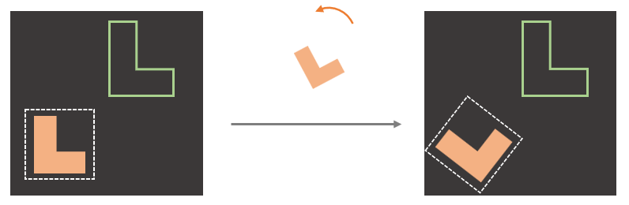
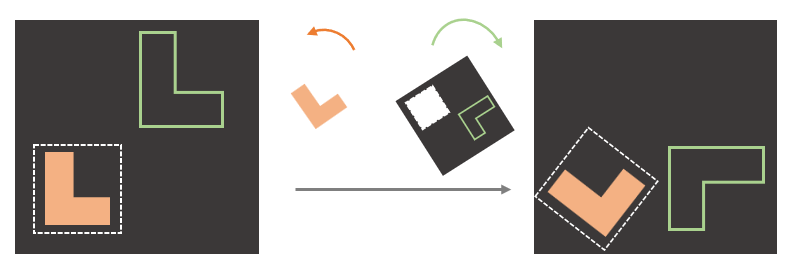
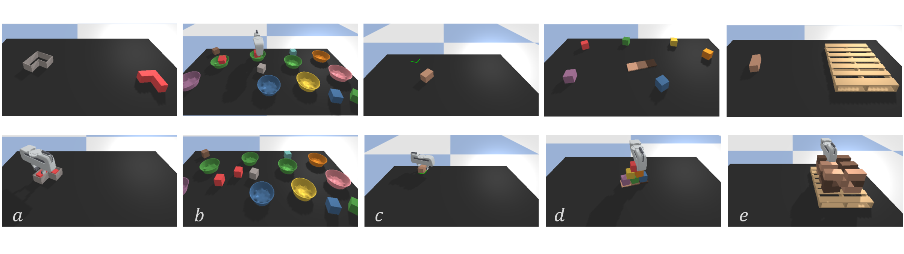

**Abstract:**
Transporter Net is a recently proposed framework for pick and place that is able to learn good manipulation policies from a very few expert demonstrations. A key reason why Transporter Net is so sample efficient is that the model incorporates rotational equivariance into the pick module, i.e. the model immediately generalizes learned pick knowledge to objects presented in different orientations. This paper proposes a novel version of Transporter Net that is equivariant to both pick and place orientation. As a result, our model immediately generalizes place knowledge to different place orientations in addition to generalizing pick knowledge as before. Ultimately, our new model is more sample efficient and achieves better pick and place success rates than the baseline Transporter Net model.

## Paper &nbsp;&nbsp; &nbsp;&nbsp; [PDF](https://arxiv.org/abs/2202.09400)&nbsp;&nbsp;•&nbsp;&nbsp; [CODE](https://github.com/HaojHuang/Equivariant-Transporter-Net)&nbsp;&nbsp;•&nbsp;&nbsp;

  

    
    

      <a href="https://haojhuang.github.io">Haojie Huang</a>
    

  

  

    
    

      <a href="https://pointw.github.io">Dian Wang</a>
    

  

  

    
    

      <a href="http://mathserver.neu.edu/robin/">Robin Walters</a>
    

  

  

    
    

      <a href="http://www.ccs.neu.edu/home/rplatt/">Robert Platt</a>
    

  

&nbsp;&nbsp; &nbsp;&nbsp; &nbsp;&nbsp;&nbsp;&nbsp; &nbsp;&nbsp; Khoury College of Computer Sciences, Northeastern University

## Elevator Pitch

  

    
    
 C_n Equivariance

  

  

    
    
 C_n times C_n Equivariance 

  

New line here
 

  

    
    
Block Insertion

  

  

    
    
Place Boxes in Bowls 

  

  

    
    
Stack Block Pyramid

  

  

 

## Highlight

## Citation

## Contact

